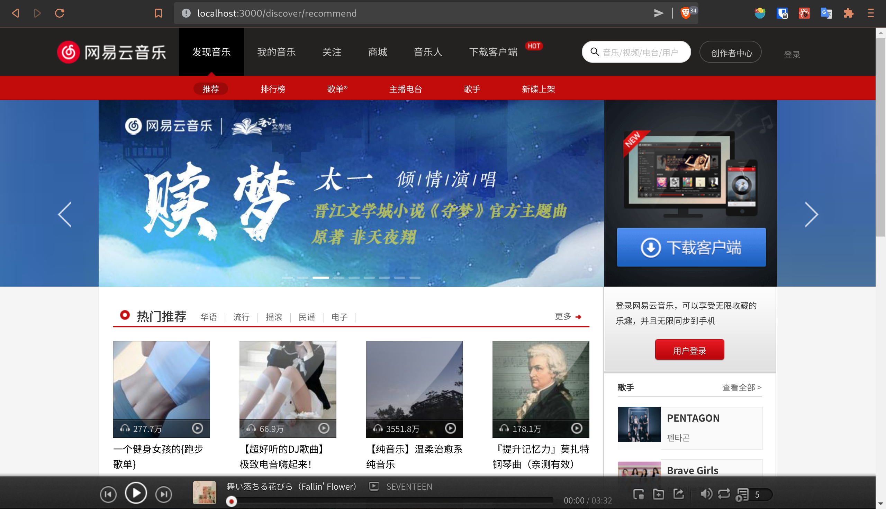
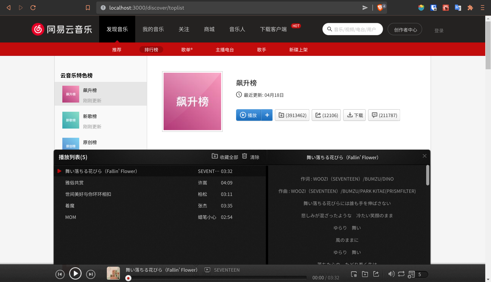

# 基于React的网易云Web端实现

## 项目简介
基于`React`, `Redux`, `react-redux`, `react-router-dom`, `axios`, `styled-components`, `antd` 实现的网易云Web端项目, 接口使用了 [NeteaseCloudMusicApi](https://binaryify.github.io/NeteaseCloudMusicApi/#/)

## 项目预览

&nbsp;

## 项目开启方式
修改/services/config.js文件, 将devBaseURL改为自己部署的`NeteaseCloudMusicApi` 地址, 此处设置的是: localhost:4000

### `yarn start`
在开发模式下运行
打开 [http://localhost:3000](http://localhost:3000) 以在浏览器中预览